As part of my curriculum at [Polytechnique](https://polytechnique.edu) I took a numerical physics class where we had to implement a research paper on a specific algorithms from computational physics.

I paired with a friend to implement a paper written by [Assaad and Evertz on _World-line and Determinantal Quantum Monte Carlo Methods for Spins, Phonos and Electrons_](./papier_EA.pdf).

The code is available here <https://github.com/jaymun723/quantum-monte-carlo>. You can find the PDF version of this article [here](./EA_Quantum_Monte_Carlo-5.pdf).

# Introduction

Problems in solid-state physics often require computationally demanding calculations, as their complexity typically scales as a power of system size. Spin chains and electron chains exhibit strong correlations, making exact solutions infeasible for large systems. However, one-dimensional (1D) spin chains provide a good balance between analytical tractability and physical relevance. In this study, the focus is placed on 1D XXZ chains, where correlations along the $x$ and $y$ axes are identical. This framework allows verification of theoretical predictions, assessment of approximations, and extrapolation of system properties to larger sizes. The Monte Carlo method described in [Assaad and Evertz](./papier_EA.pdf) was implemented using three distinct update schemes.

We want to understand the physical properties of a system described by the following hamiltonian :

## The XXZ Hamiltonian

The XXZ model describes a chain of interacting spin-$\frac{1}{2}$ particles with nearest-neighbour coupling and anisotropy between the $xy$-plane and the $z$-direction. The Hamiltonian is given by

$$
\begin{equation}
H = J_{x}\sum_{i}(S_{i}^{x}S_{i+1}^{x} + S_{i}^{y}S_{i+1}^{y}) + J_{z}\sum_{i}S_{i}^{z}S_{i+1}^{z}
\end{equation}
$$

Periodic boundary conditions are imposed such that $S_i = S_{i+n}$. The coupling constants $J_x$ and $J_z$ define the physical regime of the system: the $J_z$ term represents an Ising-like interaction, favouring spin alignment ($J_z<0$) or anti-alignment ($J_z>0$), whereas $J_x$ induces quantum fluctuations through spin exchanges between neighbouring sites.

## Computational complexity

Although the Hamiltonian can be written compactly, evaluating thermodynamic quantities such as specific heat, magnetic susceptibility, or spin stiffness requires computation of the partition function $Z = \mathrm{Tr}[e^{-\beta H}]$.

This presents a mathematical challenge: the Hilbert space of a quantum system grows exponentially with its physical size. Since each local spin has two basis states ($\ket{\uparrow}$ and $\ket{\downarrow}$), the dimension of the total Hilbert space is:

$$
\begin{equation}
    \text{dim}(\mathcal{H}_n) = 2^n
\end{equation}
$$

For very small systems, one can perform diagonalization of the Hamiltonian matrix. However, this approach becomes impossible for large systems. Therefore, it is necessary to use other numerical approaches to solve for larger systems that do not require the full matrix diagonalization. Nevertheless, this exact calculation is crucial for testing the numerical method on smaller systems and for extrapolating to larger ones.

# World-line approach

## Trotterization

Following the derivation by [Assaad and Evertz](./papier_EA.pdf), the problem is simplified to make it tractable numerically. Let $H^{(i)} = J_{x}(S_{i}^{x}S_{i+1}^{x} + S_{i}^{y}S_{i+1}^{y}) + J_{z}S_{i}^{z}S_{i+1}^{z}$ be the two-site Hamiltonian, whose eigenvalues are known. Then, $H_1$, the sum of the even two-sites, and $H_2$, the sum of the odd terms, are two sums of commuting Hamiltonians. Introducing the discretisation $\Delta\tau \equiv \frac{\beta}{m}$, Trotter’s formula approximates the partition function as:

$$
\begin{align*}
Z &= \text{Tr}[(e^{-\Delta\tau H})^{m}] \\
    &= \text{Tr}[(e^{-\Delta\tau  H_{1}}e^{-\Delta\tau  H_{2}})^{m}] + \mathcal{O}(\Delta\tau^{2}) \\
        &=\sum_{\pmb{\sigma}_1 \dots \pmb{\sigma}_{2m}} \bra{\pmb{\sigma}_1} e^{-\Delta\tau H_1} \ket{\pmb{\sigma}_{2m}} \cdots \braket{\pmb{\sigma}_2|e^{-\Delta\tau H_2}|\pmb{\sigma}_1} + \mathcal{O}(\Delta\tau^{2})
\end{align*}
$$

Then, $\Delta\tau$ can then be interpreted as a discrete imaginary time step, mapping the 1D system into a 2D configuration with a progression from $\tau = 0$ to $\tau = m\Delta\tau = \beta$ as the additional dimension. This conversion allows to treat this system with a classical approach, thus enabling Monte Carlo methods.

**Figure 1**: World-line configuration for $8$ spin sites and $m=4$. Red represents up spins and blue represents down spins.

This system can then be represented as a world-line configuration tracking the evolution of the chain's spin configurations through time and space. This representation possesses interesting properties, such as spin conservation, which simplifies the calculation by eliminating spin evolution or 2D configurations not having a meaningful contribution at first order on $\Delta\tau$.

Periodic boundary conditions are chosen as they ensure that boundary effects are minimised. In practice, $m$ needs to be large enough so as to minimise the effects of the Trotterization.

As for the code, a `Worldline` is represented by a matrix of size $2m \times n$ containing $\pm1$ values depending on the state of the spin at that location.

## Weight and energy of world-lines

Each `Worldline` has its own weight denoted as $\Omega(\omega)$.

From [Assaad and Evertz](./papier_EA.pdf):

$$
\begin{equation}
    \Omega(\omega) = \prod_{i=1}^{2m} \braket{\pmb{\sigma}_{i+1}|e^{-\Delta\tau H_i}|\pmb{\sigma}_{i}}
\end{equation}
$$

Where $H_i$ is $H_1$ if $i$ is odd and $H_2$ otherwise. Periodic boundary conditions give $\pmb{\sigma}_{2m+1}=\pmb{\sigma}_{1}$.

With equation 3, the total weight is the product of the weight of each line.

$$
\begin{equation}
    \braket{\pmb{\sigma}_{i+1}|e^{-\Delta\tau H_i}|\pmb{\sigma}_i} =
    \prod_{j=i}^{n/2} \braket{\sigma_{2j, i+1}, \sigma_{2j+1, i+1} |e^{-\Delta\tau H_i}|\sigma_{2j,i},\sigma_{2j+1,i}}
\end{equation}
$$

And equation 4 gives that each line weight is the product of the weight of each of its white plaquette.

_Note: In the code `i` and `j` are switched from the usual convention to match the notation used in the paper._

The combination of equations 3 and 4 gives a straightforward algorithm to compute the weight of a `Worldline`:

$$
\begin{equation}
     \Omega(\omega) = \prod_{p} W_p
\end{equation}
$$

Where $p$ is taken over all white plaquettes of $\omega$ and $W_p$ is the plaquette weight.

The energy associated with a configuration is: (from [Assaad and Evertz](./papier_EA.pdf))

$$
\begin{equation}
    E(w) = -\frac{1}{m} \sum_{p} \frac{\partial}{\partial \Delta\tau} \ln(W_p)
\end{equation}
$$

Based on the weights provided in [Assaad and Evertz](./papier_EA.pdf):

- **Full Squares:**
  $$
  \begin{align}
      W &= e^{-\Delta\tau J_z / 4} \\
      -\frac{\partial}{\partial \Delta\tau} \ln(W) &= -\frac{\partial}{\partial \Delta\tau} \left( -\frac{\Delta\tau J_z}{4} \right) = \frac{J_z}{4}
  \end{align}
  $$
- **Vertical World-Lines:**
  $$
  \begin{align}
      W &= e^{\Delta\tau J_z / 4} \cosh\left(\frac{\Delta\tau J_x}{2}\right) \\
      -\frac{\partial}{\partial \Delta\tau} \ln(W) &= -\left( \frac{J_z}{4} + \frac{J_x}{2} \tanh\left(\frac{\Delta\tau J_x}{2}\right) \right)
  \end{align}
  $$
- **Crossed World-Lines:**
  $$
  \begin{align}
      W &= -e^{\Delta\tau J_z / 4} \sinh\left(\frac{\Delta\tau J_x}{2}\right) \\
      -\frac{\partial}{\partial \Delta\tau} \ln|W| &= -\left( \frac{J_z}{4} + \frac{J_x}{2} \coth\left(\frac{\Delta\tau J_x}{2}\right) \right)
  \end{align}
  $$

## Generating world-line configurations

In order to test the validity of Trotter's formula and our calculation method, one can generate all possible valid configurations for small grids. This allows to make exact calculations and compare them to our results.

The first approach took was to generate all the spin configurations possible and to keep only the valid ones. While straightforward to implement, this approach was computationally inefficient, as it required computing $2^{2 m n}$ configurations.

The second approach consisted of recursively generating a world-line with backtracking whenever an invalid configuration was encountered. Enforcing periodic boundary conditions proved more difficult than expected, resulting in reduced implementation efficiency. Each world-line was generated until an invalid configuration appeared on a white plaquette, at which point the process was halted. However, this algorithm did not yield significant improvement over the previous one, as the number of configurations continued to grow exponentially. The method could be optimised by detecting invalid configurations earlier to avoid generating multiple invalid branches. Using this approach, all valid configurations were generated for systems with fewer than six sites and $m \le 4$ in under one minute. For eight sites at $m = 4$, computational limitations prevented full enumeration, although the number of valid configurations is estimated to exceed $10^6$.

| n/m   | 1   | 2    | 3     | 4     |
| :---- | :-- | :--- | :---- | :---- |
| **2** | 6   | 18   | 66    | 258   |
| **4** | 18  | 90   | 546   | 3618  |
| **6** | 66  | 546  | 6840  | 94386 |
| **8** | 258 | 3618 | 94386 | -     |

**Table 1**: Number of valid configurations for $n$ sites and different values of $m$

The generation of all world-lines enabled the computation of the Trotterization error which is shown in figure 6.

# Metropolis algorithm

To perform a complete Monte Carlo simulation, the Metropolis algorithm was used and three different update schemes were implemented.

## Local shifts

The first update approach is by shifting spin lines on a shaded plaquette.

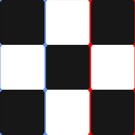
**Figure 2 (a)**: Configuration side

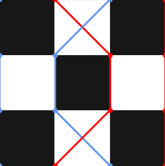
**Figure 2 (b)**: Configuration crossed

The advantage of this technique is its ease of implementation as the energy and weight shifts are trivial to compute, and the move has a symmetric probability.

The major drawback of this update method is that it is not ergodic. Indeed, the number of up spins remains the same throughout the move, and same for the winding number. This restricts the simulation to a subspace of the problem.

## Vertex updates

The second update method is inspired by the original papet and uses the mapping to the 6-vertex problem.

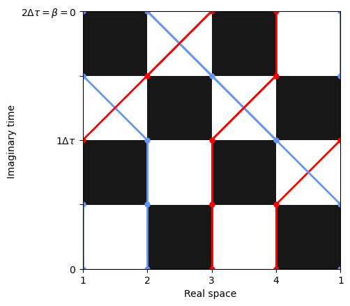
**Figure 3 (a)**: Initial configuration

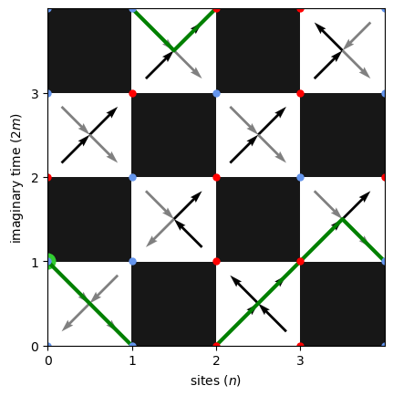
**Figure 3 (b)**: Vertex representation

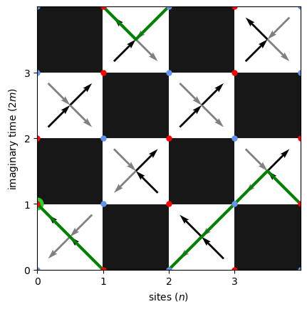
**Figure 3 (c)**: Loop transformation

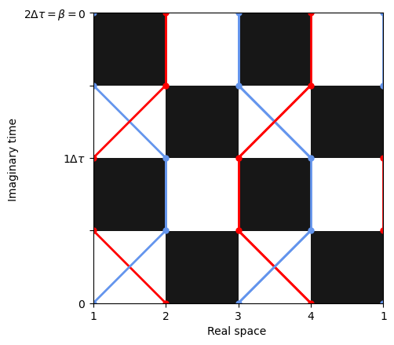
**Figure 3 (d)**: Final configuration

Once the problem is mapped to the vertex representation, a random location is selected, and a random path is traced following the vertex orientations. This path necessarily returns to its starting point, forming a closed loop. The directions of the vertices encountered along the path are then inverted, producing another valid world-line configuration. Prior to the flip, the weight associated with the exchange along the loop is computed, as the move is subject to the Metropolis acceptance criterion. The transition probability is symmetric.

Any two configurations can be connected by flipping an appropriate set of loops, demonstrating ergodicity.

- **The configurations differ by a finite number of loops.** Consider two configurations, $A$ and $B$, in their six-vertex representations. For each white plaquette, either $A$ and $B$ share the same vertex configuration or they contain two arrows in opposite directions. In the latter case, exactly two arrows must be reversed, since each square possesses two outgoing and two incoming arrows. Because the arrows form continuous loops across all world-lines, the set of differing arrows between $A$ and $B$ corresponds to a collection of closed loops.
- **All loops are possible.** Since paths are generated randomly and the visited plaquettes are chosen at random, any loop present in the configuration space can, in principle, be produced by the algorithm.

## Loop updates

The last update method implemented is the one described in [Assaad and Evertz](./papier_EA.pdf).

It is first observed that each vertex configuration can be traversed in three distinct ways. Consequently, each plaquette is associated with three possible graphs, as illustrated in figure 4.

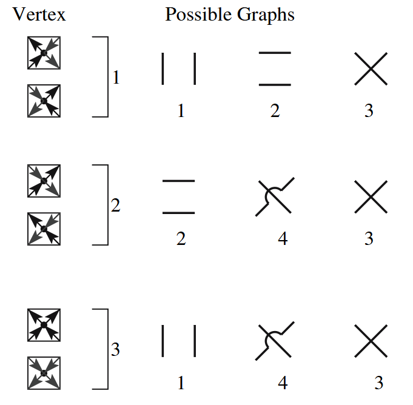
**Figure 4**: Correspondence between vertex drawings and graphs. Taken from [Assaad and Evertz](./papier_EA.pdf) and adapted.

Weights are defined for each plaquette–graph combination as $W(S, G)$, where $S \in \{1, 2, 3\}$ denotes the plaquette type and $G \in \{1, 2, 3, 4\}$ denotes the graph, such that the normalisation condition holds.

$$
\begin{equation}
W(S)=\sum_G W(S, G)
\end{equation}
$$

From figure 4, it follows that $W(1, 4) = W(2, 1) = W(3, 2) = 0$.

These weights are used to define the probability associated with selecting a particular graph.

$$
\begin{equation}
\mathbb{P}\left(S \to (S, G)\right) = \frac{W(S, G)}{W(S)}
\end{equation}
$$

Once each plaquette has been mapped to a corresponding graph, multiple loops spanning the entire world-line configuration are obtained. A [Union–Find](https://en.wikipedia.org/wiki/Disjoint-set_data_structure) data structure is employed to construct these loops, as illustrated in figure 5.

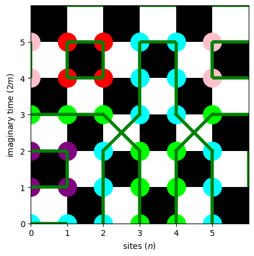
**Figure 5**: Partition of the word-line in loops. The green lines are the graphs. _Note: the crossed lines represents graph 4 and not 3._

For each loop defined by the graphs, it is then determined whether to flip the spins. The probability of such a flip is computed accordingly:

$$
\begin{equation}
\mathbb{P}\left((S, G) \to (S', G)\right) = \frac{W(S', G)}{W(S, G) + W(S', G)}
\end{equation}
$$

To ensure symmetric transition probabilities in the Metropolis algorithm, it is required that for any $G$ and compatible $S$ and $S'$, the symmetry condition holds:

$$
\begin{align}
W(S, G) = W(S', G)
\end{align}
$$

By combining equations 15 and 16, the following relation is obtained.

$$
\begin{equation}
\mathbb{P}\left((S, G) \to (S', G)\right) = \frac{1}{2}
\end{equation}
$$

Moreover the detailed balance is given by:

$$
\begin{align*}
W(S) \mathbb{P}\left(S\to S'\right) &= W(S)\sum_G \mathbb{P}\left(S\to (S, G)\right)\mathbb{P}\left((S, G) \to (S', G)\right) \\
&=\sum_G W(S)\frac{W(S, G)}{W(S)}\mathbb{P}\left((S, G) \to (S', G)\right) \\
&=\sum_G W(S', G)\mathbb{P}\left((S, G) \to (S', G)\right) \\
&=\sum_G \frac{W(S')}{W(S')} W(S', G)\mathbb{P}\left((S', G) \to (S, G)\right) \\
&=\sum_G W(S')\frac{W(S', G)}{W(S')} \mathbb{P}\left((S', G) \to (S, G)\right) \\
&= W(S')\sum_G \mathbb{P}\left(S'\to (S', G)\right)\mathbb{P}\left((S', G) \to (S, G)\right) \\
&= W(S') \mathbb{P}\left(S'\to S\right)
\end{align*}
$$

Thus, each loop has a probability of one half to be flipped.

The expressions for $W(S, G)$ are then derived. Following equation 13 and 16, the system of equations can be written as:

$$
\begin{align*}
W(1) &= W(1, 1) + W(1, 2) + W(1, 3) \\
W(2) &= W(1, 2) + W(2, 4) + W(1, 3) \\
W(3) &= W(1, 1) + W(2, 4) + W(1, 3)
\end{align*}
$$

The system contains four variables but only three independent equations. The parameter $W(1, 3) = f$ is selected as a free variable. After algebraic manipulation, the following expressions are obtained:

$$
\begin{align*}
W(1, 1) &= \frac{1}{2}\left(W(1) + W(3) - W(2) - f\right) \\
W(1, 2) &= \frac{1}{2}\left(W(1) + W(2) - W(3) - f\right) \\
W(2, 4) &= \frac{1}{2}\left(W(2) + W(3) - W(1) - f\right) \\
\end{align*}
$$

To ensure that all graph weights remain positive, the resulting conditions on the weight values must be satisfied:

$$
\begin{align*}
W(1) &\leq W(2) + W(3) \\
W(2) &\leq W(1) + W(3) \\
W(3) &\leq W(1) + W(2)
\end{align*}
$$

For implementation simplicity, the parameter $f$ is set to zero, which restricts each plaquette to only two possible graphs.

The ergodicity of the method follows from the previous demonstration of ergodicity. Since any two configurations differ by a finite set of loops, and the present algorithm can generate and flip such loops, the method is therefore ergodic.

# Discussion

Different update methods were compared by computing physical observables for small system sizes, where exact results are available for validation. These benchmarks were then extended to larger systems.

All Monte Carlo simulations were performed with identical parameters: $n_\text{cycle}=5000$, $\text{length\_cycle}=2mn$, $n_\text{rep}=10$. Error bars represent the standard deviation across the $n_\text{rep}$ runs scaled down by $\sqrt{n_\text{rep}}$.

The formulation from [Assaad and Evertz](./papier_EA.pdf) was used to correct for Trotterization errors and compute observables:

$$
\begin{equation}
    \langle O \rangle = \frac{\text{Tr} \left[ e^{-\beta H} O \right]}{\text{Tr} \left[ e^{-\beta H} \right]} = \frac{\sum_{w} \Omega(w) O(w)}{\sum_{w} \Omega(w)}
\end{equation}
$$

The largest system for which exact results were available was an $8$-spin chain, simulated for several values of $m$.

## Energy

The energy was computed for the three update schemes. As discussed previously, the local shift method is not ergodic and therefore conserves the total spin, restricting the accessible configuration space.

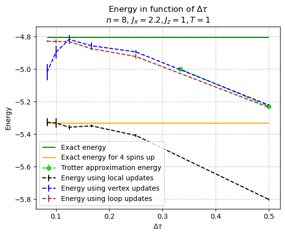
**Figure 6 (a)**: Energy as a function of $\Delta\tau$

.png>)
**Figure 6 (b)**: Error in log scale

The energy error for all methods is dominated by the Trotter approximation at large $\Delta\tau$. However, for smaller values of $\Delta\tau$,the computed energies agree closely with the exact values, validating the model and suggesting the criterion $\Delta\tau \sim 0.1 J^{-1}$ for accurate calculations. \cref{fig:graphe_b2} indicates that the error scales as $\mathcal{O}(\Delta\tau^{1.83})$, which is consistent with the expected $\mathcal{O}(\Delta\tau^{2})$. The deviation observed for the vertex update is alter discussed.

The advantage of the numerical methods becomes clear for larger systems, such as 10 spin sites and $m = 6$ as can be seen in figure 7. The loop updates algorithm is able to calculate the energy for this larger system whereas the exact calculation was not possible.

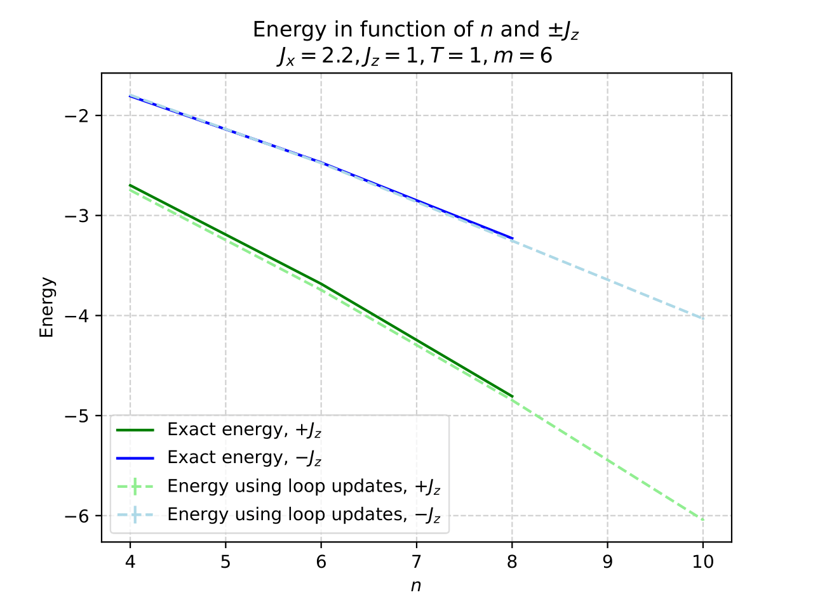
**Figure 7**: Energy as a function of the number of sites for $m=6$

The model also allows computation of spin–spin correlation functions. Since each line represents a valid spin configuration, the correlation operator was averaged over all positions and imaginary-time slices:

$$
\begin{equation}
\left<S^z S^z_d\right> = \frac{1}{2mn} \sum_{j,i} S_{j,i}S_{j,i+d}
\end{equation}
$$

The exact correlation is computed as in equation 20 only on the first site (the value does not depend on the site).

$$
\begin{equation}
\left<S^z S^z_d\right> = \frac{\text{Tr}\left(e^{-\beta H}S^z_0S^z_d\right)}{\text{Tr}\left(e^{-\beta H}\right)}
\end{equation}
$$

The simulation accurately reproduced the correlations in both the ferromagnetic and antiferromagnetic regimes (figure 8).

_Note: Other update schemes were not employed for this observable due to insufficient accuracy in their energy estimates._

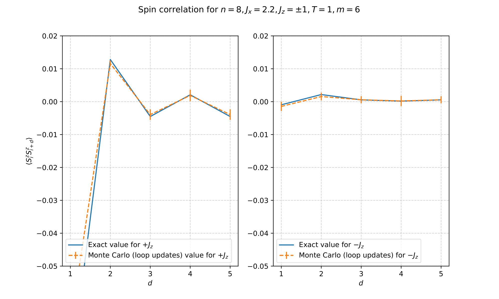
**Figure 8**: Spin correlation computed using loop updates

The influence of the coupling $J_x$ on spin correlations was also examined (figure 9).

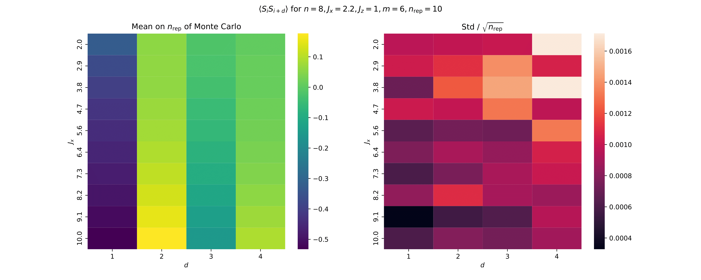
**Figure 9**: Spin correlation as a function of $J_x$. _The graphs must be understood as follows : the right heat-map shows mean correlations values on the $n\\_\text{rep}$ runs and the left heat-map gives the uncertainty ($\text{std}/\sqrt{n\\_\text{rep}}$) on each of the mean values of the right graph.\_

## Efficiency of the different update methods

The efficiency of each scheme was evaluated using two metrics: computation time (figure 10) and acceptance rate (table 2).

**Figure 10**: Computation time for different update algorithms

| m               | 2     | 4     | 6    | 8    | 10   | 12   |
| :-------------- | :---- | :---- | :--- | :--- | :--- | :--- |
| Acceptance rate | 46,6% | 13,2% | 5,9% | 4,0% | 3,3% | 2.5% |

**Table 2**: Acceptance rate for vertex update for $10^5$ tries

Although the loop update requires longer computation times, its acceptance rate remains close to $100\%$, meaning that almost every proposed update results in a configuration change. However, for the vertex update the acceptance rate drops significantly as $m$ increases. Thus, for large $m$, roughly $50\times$ more trials are required to accept an update. This can be seen in figure 6: for smaller $m$, the accuracy of the vertex update decreases. This is probably due to an insufficient amount of accepted updates leading to inaccurate calculations. To conclude, the high acceptance rate of the loop update is essential for obtaining accurate results on large systems, justifying its longer computation time. This qualitative analysis could be verified by calculating the autocorrelation time which measures the necessary number of steps to obtain a decorrelated configuration. Efficiency could be defined as the inverse of the product of the autocorrelation and computation times.

In summary, the loop update proved to be the most accurate and efficient method implemented.
