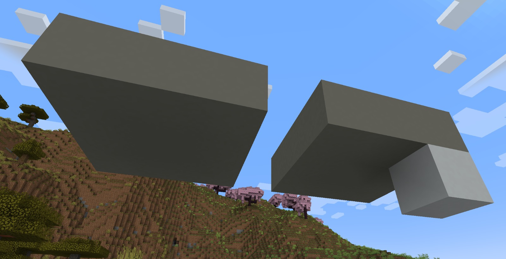

This is the result of project made for a [Polytechnique course on 3D programming](https://graphicscomputing.fr/course/2024_2025/CSC_43043_EP/). It is a collobaration between me and [Victor Llorca](https://www.linkedin.com/in/victor-llorca/).

The code is available here: https://github.com/Jaymun723/Voxel-engine-for-Markov-algorithms.

To move the car use the WASD commands.

## Introduction

In this project, we chose to implement procedural generation using a voxel (volumetric pixel) management system and generation rules derived from Markov algorithms.

To showcase this project, we placed this scene in an urban context, where a car can move along roads bordering plots generated using Markov algorithms.

## 1 - The Voxel Engine

A voxel engine is a method for displaying landscapes made up of blocks. The three main elements of a voxel engine are:

### 1.a) The blocks (or voxels)

In our project, the world is entirely filled with blocks. A block is simply a memory representation containing a type that defines how the space it occupies should be filled. The block type is also used by the Markov algorithm.
The most important type is `BlockType_Empty`; it designates the absence of "physical" filling.

### 1.b) The chunks

A chunk is a grouping of `(l * w * h)` blocks. In our final version, a chunk is a group of 16 _ 16 _ 16 = 4,096 blocks.
It is within the chunk that the first graphical phase occurs. Each chunk is assigned a mesh which will then be loaded or not. The mesh calculation involves a method called "Face culling" to avoid including unnecessary triangles. The principle relies on the fact that if two (non-empty) blocks share the same face, then that face is not visible to the user.

### 1.c) The chunk manager

The chunk manager is responsible for creating chunks as the player moves and keeping them in memory. If chunks are too far away (relative to a certain `RENDER_DISTANCE`), it unloads them to prevent the graphics card from becoming overloaded. To avoid conflicts during random generation, chunks currently being generated by the Markov method are not rendered but continue to be updated if they go outside the `RENDER_DISTANCE`.

## 2 - Markov Algorithms

The simplest structure used by Markov algorithms is the notion of a rule. A rule is simply defined by an application condition and an application function. It allows for the transformation of a set of voxels into another.
For example, to start the pillars of a house, we wish to replace the pattern on the left with the pattern on the right. Concretely, we place a white pillar under a gray block that has only 2 neighbors.

A set of rules is called a Markov rule. It is applied in the following way:
